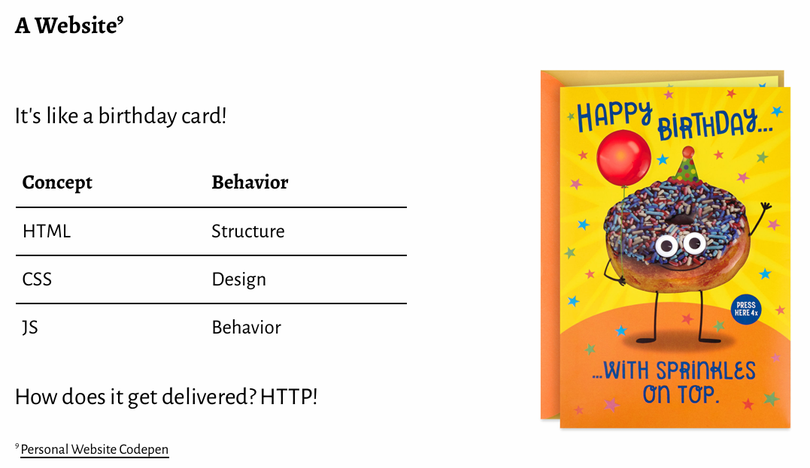
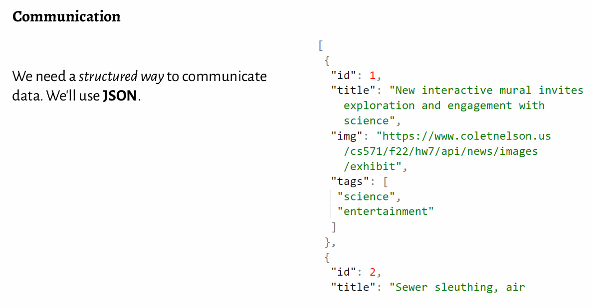
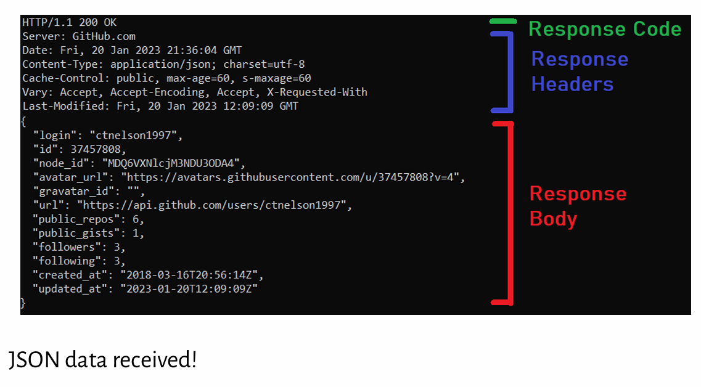
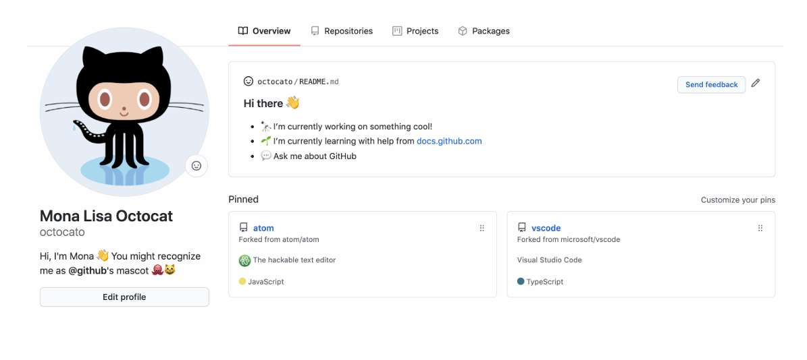

# Lec1 Web Intro
## What is Web?

## Real-World Example
How does GitHub display profile webpages?

Why JSON?
- easy to understand
- human-readable
- language agnostic
- easily convertible to JS objects

## JSON basics
- valid value types
    - string (with double quotes)
    - number
    - object e.g. {"name": "Carl", "age": 24}
    - array
    - boolean
    - null
- values can be nested

